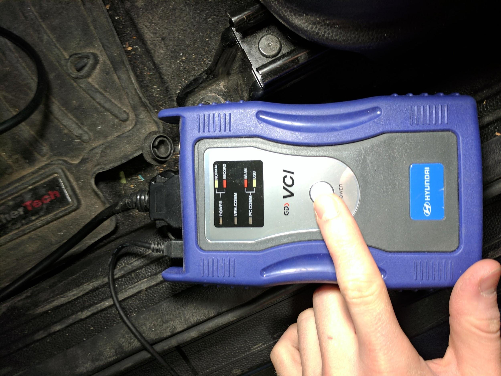
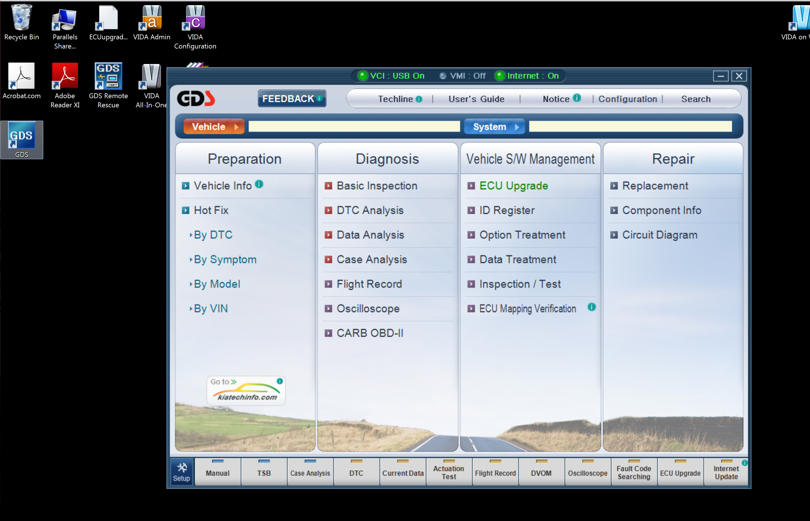
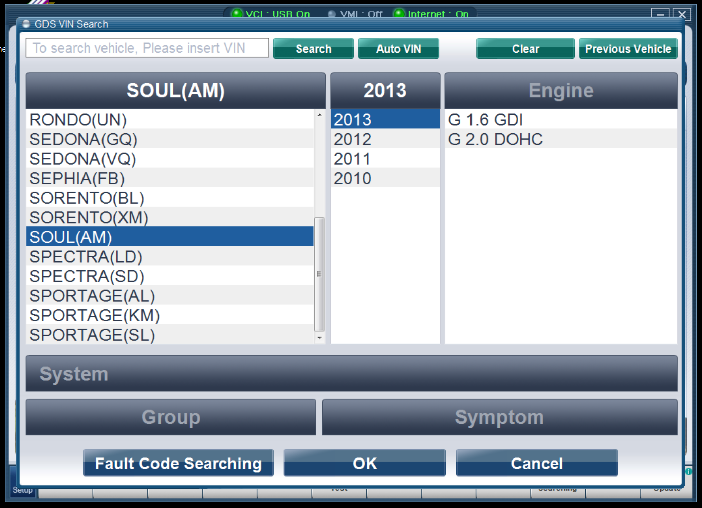
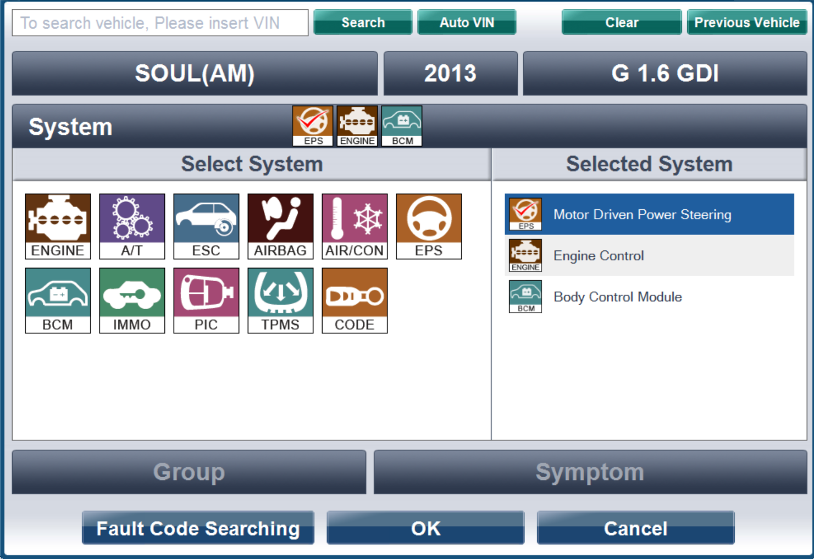
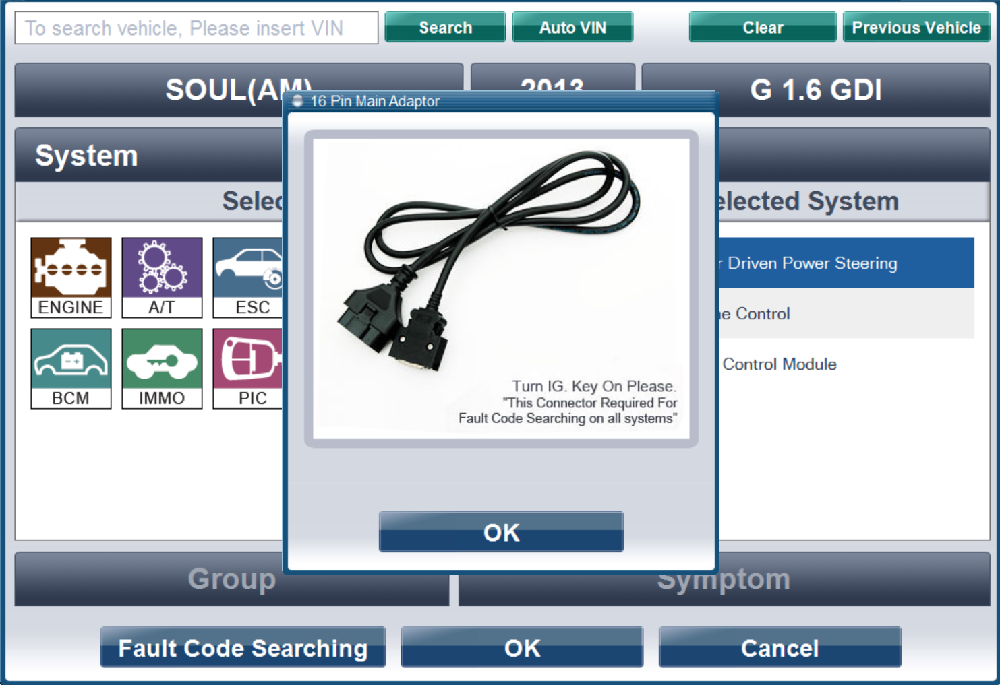
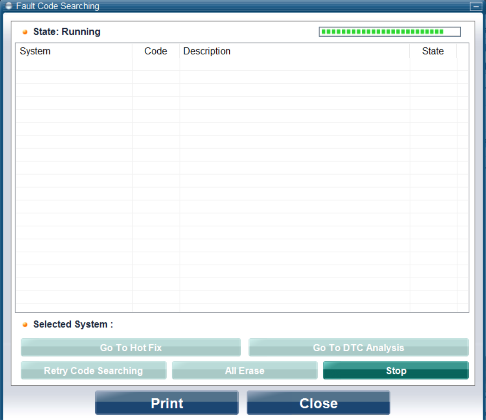

**Procedure for recovering from a hard fault on a Kia Soul**

If you have hard faulted your Kia Soul then you will need to follow this tutorial to reset the vehicle to a drivable state.

The first step is to make sure you correct whatever caused the hard fault in the first place. Whether it was not properly constraining torque requests for the steering controller or something else; if this is not fixed then the vehicle will re-enter the hard fault again and this process will be useless.

1. Switch the vehicle and all OSCC modules off.

2. Plug the diagnostics tool into the OBDII connection on the vehicle. Most likely this connector will be plugged into the OSCC modules so you will have to disconnect this before attaching the diagnostics tool.

3. Switch the vehicle ignition to "ON" but do not start the ignition.

4. Start up your diagnostics tool by pressing the button on the device. 

5. Connect whatever device you are using to talk to the diagnostics tool. 

6. Once the software is started up select the make and model of your vehicle (Kia Soul PS or AM). The year should be whatever is closest to your vehicle year. 

7. In the next screen select the systems which you want to analyze. You can select as many as you need, typically at least "EPS" is necessary. 

8. Make sure you follow the instructions on this screen and then hit "OK". 

9. Select "Fault Code Searching" on this screen. 

10. The software will begin searching for fault codes. 

11. Select "All Erase" on the screen displaying the list of fault codes found. 

12. Now you can disconnect the diagnostics tool and return the vehicle to a workable state. Start this process by turning the vehicle completely off.

13. Remove the diagnostics tool and reconnect the OBD bus to the OSCC modules.

14. Switch the OSCC modules on.

The vehicle should now be back in a workable state. Full operation including power steering and full throttle should be restored. All dash indications of an error should clear. If for some reason the vehicle is still in a hard fault then you may need to look deeper into what is causing the issue, and then repeat this process. Sometimes what looks like a hard fault is actually just a loose connection to the throttle or steering modules; which causes the car to detect an error every time it starts up.

**Why your vehicle may have faulted**

Typically faults on the Kia are caused by the vehicle's native systems detecting abnormal operation of the vehicle. Most of these faults can be solved by fixing the issue that caused the car to think it was in an abnormal state and then restarting the vehicle. The most common cause of these "soft faults" is just forgetting to turn on the OSCC modules before turning on the car. Other less common causes are loose connections between the OSCC modules and the vehicle's native modules that they control (or spoof).

Some faults, however, are "hard faults" and cannot be cleared by fixing the issue and restarting the vehicle. This is when we need the above tutorial. Typical causes of these faults are modification of the arduino code that is loaded onto the OSCC steering or throttle modules. If this code is modified improperly, then potentially the modified OSCC modules could request a steering torque or throttle value that is out of range of what the vehicle can handle. The vehicle's native ECU will detect that this requested value is out of range and will assume there is something very wrong with vehicle operation. It will then throw a DTC code and hard fault.
